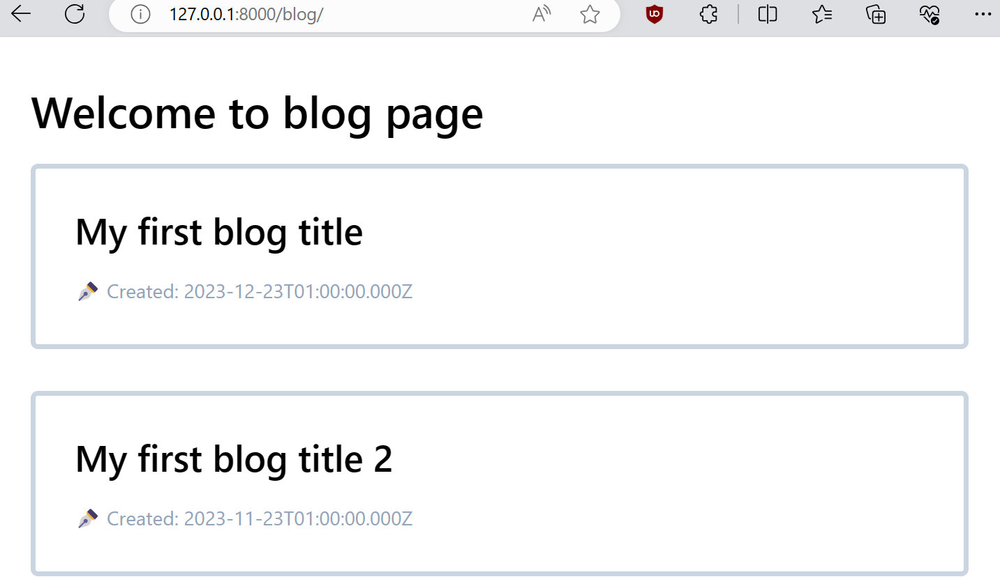
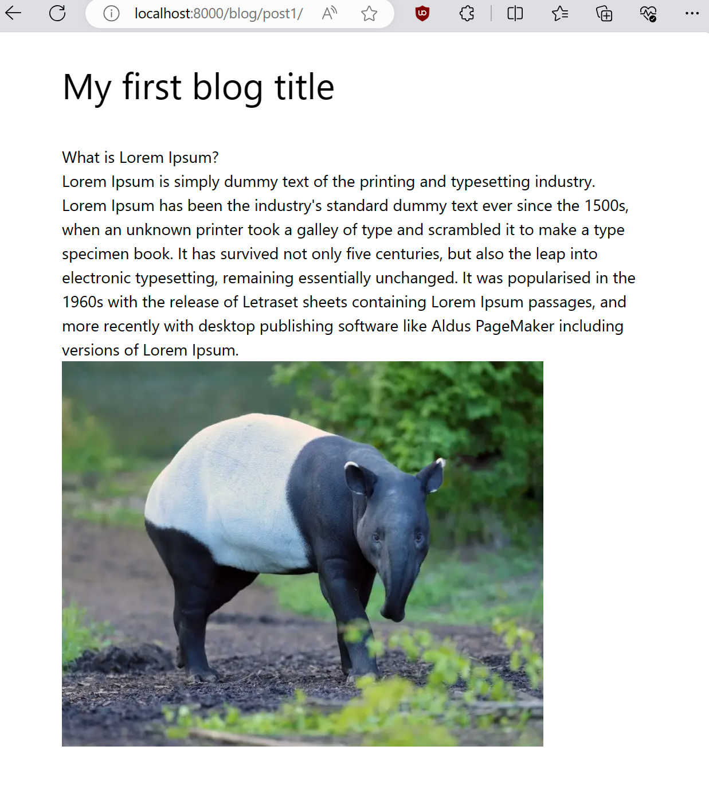

Welcome to our tapirs' home!

We had made significant progress, by creating the blog with latest version of GatsbyJS.
GatsbyJS recently upgraded to v5 few weeks ago.
In this post we will write down the steps on how to start your blog with GatsbyJS with 
TypeScript... and MDX.

What is MDX? Well, it is a markdown extension that allowed you to insert 
JSX element and css styling to markdown files, which might be useful if 
you want to insert interactive into your markdown document. But the tradeoff will 
be slower down the build time.

In this post, I assume that you might be familiar with 
- TypeScript
- ReactJS

If you have not learn these before. Don't worried, you can still create your own 
gatsby blog by following the steps in this article.

# Create new gatsby site

First off, you need to install the `gatsby-cli` in your local environment. 
You can refer to the official site on how to setup `gatsby-cli`. For myself, 
I installed it globally in my WSL2 Ubuntu 22.04:

```bash
npm install -g gatsby-cli
```

Once installed, you can now generate a starter gatsby blog in CLI. 
Good things is that it now ask whether you like to install any gatsby plugins.
(I remeber those days I had to setup tailwind css myself, sometimes no luck 
and raised bunch of dependencies errors.)
Name your project whatever name you like, and follow the choices as below:


Next, we are going to navigate the `hello-world` project. You can now 
start local server by running `npm run start`, then go to 
`localhost:8000` in your favourite browser.

```bash
cd ./hello-world
npm run start   # or `gatsby start`
```

Note that for the last section, the tag *"Add Markdown and MDX support"* must 
be ticked for MDX. If you missed this you have to install these MDX dependencies 
by yourself,  

```bash
npm install --save gatsby-plugin-mdx @mdx-js/mdx
```

Also, you might need to install the plugin `gatsby-remark-images`, this plugin will 
load your image responsively with Javascript at the background.

```bash
npm install --save gatsby-remark-images
```

# Adding MDX posts to your gatsby site

Now, proceed to `hello-world` project. You will notice that some folders are already 
prepared in the project.

In `src` directory, create a new folder called `posts`. This folder storing all your mdx 
files, including any image you like for your blog.

In `posts`, add new folder named `post1`, this will be the first MDX blog post for your website.
When you want to create a new post, you just create a new folder with your post title. And, 
the mdx file inside this folder <b>must named as `index.mdx`</b>. Here we gonna 
create a new post named `post1` with Lorem Ipsum:

```
mkdir -p ./src/posts/post1
nano ./src/posts/post1/index.mdx
```

```md
---
date: 2023-12-23 01:00:00
title: My first blog title
author: Tapirs
---

# What is Lorem Ipsum?

Lorem Ipsum is simply dummy text of the printing and typesetting industry. 
Lorem Ipsum has been the industry's standard dummy text ever since the 1500s, 
when an unknown printer took a galley of type and scrambled it to make a 
type specimen book. It has survived not only five centuries, 
but also the leap into electronic typesetting, 
remaining essentially unchanged. 
It was popularised in the 1960s with the release of Letraset sheets containing 
Lorem Ipsum passages, and more recently with desktop publishing software like 
Aldus PageMaker including versions of Lorem Ipsum.


```

create another second post neamed `post2` with the same index.md file. It is up to you 
if you like to change content for the second post.

```bash
mkdir -p ./src/posts/post2
cp -r ./src/posts/post1/index.mdx ./src/posts/post2
```

and include this `posts` folder in `gatsby-config.ts` as well. This 
file contained the configurations for your gatsby plugins. Fat chance is that you will come
to update this file again when you had installed any plugins in the future.

```ts
const config: GatsbyConfig = {
  "plugins": [
    // ...
    //
    // ↓ Add This few lines
    {
      resolve: 'gatsby-source-filesystem',
      options: {
        name: "posts",
        path: "./src/posts"
      }
    }, 
    {
      resolve: "gatsby-plugin-mdx",
      options: {
        gatsbyRemarkPlugins: [
          {
            resolve: 'gatsby-remark-images',
            options: {
              maxWidth: 640
            }
          }
        ]
      }
    }
    // ...
  ]
}
```

## Template For blog page

We will be adding another dicrectory called `template` inside `src`, and in 
this directory we have to create another tsx file called `blogPostTemplate.tsx`.
This will be the template for our blog pages.

In `blogTemplate.tsx`, copied the following script:

```ts
import { MDXProvider } from '@mdx-js/react';
import { graphql, PageProps } from 'gatsby';
import React from 'react';

const BlogPostTemplate: React.FC<PageProps<Queries.BlogPageQuery>> = ({
  data,
  children
}) => {
  return (
    <main className="h-full flex flex-col">
      <div>
        <div className="relative container max-w-5xl mx-auto p-8 flex flex-col">
          <h1 className="text-4xl mb-8 font-bold sm:text-3xl">
            {data.mdx?.frontmatter?.title}
          </h1>
          <article className='max-w-3xl mt-10 text-lg leading-relax text-ellipsis'>
            <MDXProvider>{ children }</MDXProvider>
          </article>
        </div>
      </div>
    </main>
  )
}

export default BlogPostTemplate;

export const query = graphql`
  query BlogPage($id: String!) {
    mdx(id: { eq: $id }) {
      tableOfContents
      frontmatter {
        title
        date
      }
      fields {
        slug
      }
    }
  }
`
```

Now please take note, there are 2 things you need to pay attention:

- The graphQL query must come with a name. e.g. `query BlogPost `, the query name 
is required for Gatsby graphql Typegen. 

- For the property of `Queries.` type, it must be the your query name followed by 
the word `Query`. For example, if your query is `FruitData`, then the type 
of PageProps is `PageProps<Queries.FruitDataQuery>`.

In this case, our page query name is `BlogPage`, the query type will be 
`Queries.BlogPageQuery`. All the query types will be updated in `src/gatsby-types.d.ts`
automatically.

## The blog page

GatsbyJS allowed user to programmatic aceess to the page creation and generate 
blog pages. In root folder, we now create a file named `gatsby-node.ts`. 
There are battery included API available to us in this file.

```ts
import { CreatePagesArgs, GatsbyNode }

const path = require("path");
const { createFilePath } = require('gatsby-source-filesystem');

// This is typescript, we are using `export const ...`
// rather than `module.createPages`. 
// In Javascript, however, you're going to use 
// the keywords `module.createPages`
export const createPages: GatsbyNode['createPages'] = async({
  graphql,
  actions,
  reporter
}: CreatePagesArgs) => {
  const { createPage } = actions;

  const query = await graphql<Queries.BlogNodeQuery>(`
    query BlogNode {
      allMdx (
        sort: {frontmatter: {date: DESC}}
      ) {
        nodes {
          id
          ields {
            slug
          }
          frontmatter {
            date
            title
          }
          internal {
            contentFilePath
          }
        }
      }
    }
  `);

  const postTemplate = path.resolve('./src/templates/blogPostTemplate.tsx');
  const createPostPromise = query.data?.allMdx.nodes.map((node) => {
    createPage({
      path: `blog${node.fields?.slug}`,
      component: `${postTemplate}?__contentFilePath=${node.internal.contentFilePath}`,
      context: { id: node.id }
      });
  });

  await Promise.all([createPostPromise]);

  if (query.errors) {
    reporter.panicOnBuild('ERR: Error occured while running GraphQL query.');
    return;
  }
}
```

A bit longer huh? Not yet finish, we still 
need to make sure it create node based on all `.tsx` files.
Again, add this part into the bottom `gatsby-node.ts`.

```ts
// ↓ Add `CreateNodeArgs`
import { CreatePagesArgs, CreateNodeArgs, GatsbyNode }

// createPages
// ...

// ↓ Add `onCreateNodes` module
export const onCreateNode: GatsbyNode['onCreateNode'] = ({ 
  node, 
  actions, 
  getNode 
} : CreateNodeArgs) => {
  const { createNodeField } = actions;

  if (node.internal.type === 'Mdx') {
    const value = createFilePath({ node, getNode });
    createNodeField({
      name: 'slug',
      node,
      value
    });
  }
}
```

and do not forget to include `gatsby-node.ts` in `tsconfig.json`. 
At the bottom of `tsconfig.json`, in the `"include"` value list:

```json
{
  "compilerOptions": {
    // ...
  }
  // ↓  Add this property
  "include": ["./src/**/*", "./gatsby-node.ts", "./gatsby-config.ts", "./plugins/**/*"]
}
```

Note that `gatsby-node.ts` and `src/templates/blogPostTemplate.tsx` must be made at the same time. 
Otherwise the graphql Typegen will not works, by right the graphQL typegen will update automatically 
when you save with CTRL + S.

# Listing blog posts in a page 

Now we are going to list down all the posts in `/blog` page. 
In `./src/pages`, create a new gatsby page `blog.tsx`.

```ts
import React from "react";
import { Link, PageProps, graphql } from "gatsby";

const BlogPages: React.FC<PageProps<Queries.BlogMdxQuery>> = ({ data }) => {
  return (
    <div className="max-w-3xl container relative mx-auto mt-10">
      <h1 className="text-4xl font-semibold mb-6">Welcome to blog page</h1>
      <div className="grid grid-rows-none gap-y-2.5">
        { data?.allMdx.edges.map(({node}) => (
          <Link
            to={`/blog${node.fields?.slug}`}
          >
            <div className="p-8 mb-6 rounded-md border-4 border-slate-300 border">
              <div className="max-w-lg relative flex flex-col">
                <h1 className="font-semibold text-xl md:text-3xl md:pb-5">
                  { node.frontmatter?.title }
                </h1>
                <p className="text-slate-400">✒️ Created: { node.frontmatter?.date }</p>
              </div>
            </div>
          </Link>
        )) }
      </div>
    </div>
  );
}

export default BlogPages;

export const query = graphql`
  query BlogMdx {
    allMdx(
      sort: {frontmatter: {date: DESC}}
    ) {
      edges {
        node {
          id
          fields {
            slug
          }
          frontmatter {
            date
            title
          }
        }
      }
    }
  }
`
```

Pff, we finally made it. Now navigate to 'localhost:8000/blog' in your browser.
Make sure that there is no error messages in the terminal. 



Now you can click on one of the post and view it.



# Conclusion

We had learned how to create a basic
MDX post template page in Gatsby 5. As we build the basic 
functionality of our blog, creating the blog post pages by fetching 
graphQL queries, and setting up the blog listing page.
You may also want to do styling 
on your pages, and add SEO tag to each page for next steps. Unfortunately there is 
no much spaces for me to write here (as the famous mathematician Fermat said).

Thanks for reading tapir's first blog, please do not hesitate to 
reach out if you have any questions.

# Further reading
[Gatsby GraphQL Typegen
](https://www.gatsbyjs.com/docs/how-to/local-development/graphql-typegen/)