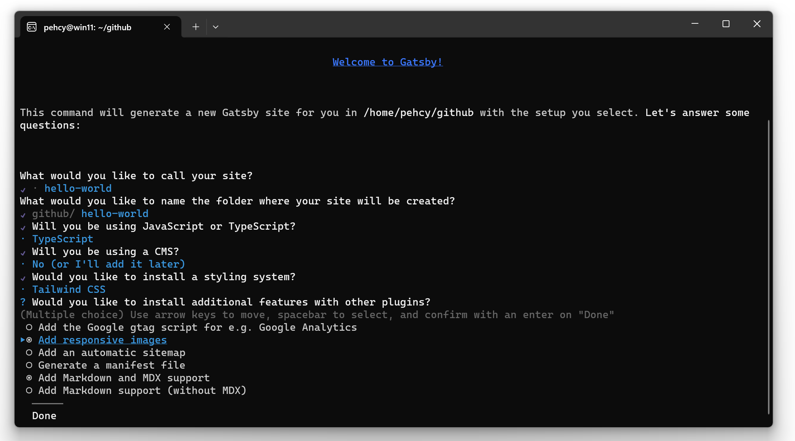

Welcome to out tapirs' home!

We had made significant progress, by creating the blog with latest version of GatsbyJS.
GatsbyJS recently upgraded to v5 few weeks ago.
In this post we will write down the steps on how to start your blog with GatsbyJS with 
TypeScript... and MDX.

What is MDX? Well, it is a markdown extension that allowed you to insert 
JSX element and css styling to markdown files, which might be useful if 
you want to insert interactive into your markdown document. But the tradeoff will 
be slower down the build time.

In this post, I assume that you might be familiar with 
- TypeScript
- ReactJS

If you have not learn these before. Don't worried, you can still create your own 
gatsby blog by following the steps in this article.

# Create new gatsby site

First off, you need to install the `gatsby-cli` in your local environment. 
You can refer to the official site on how to setup `gatsby-cli`. For myself, 
I installed it globally:

```bash
npm install -g gatsby-cli
```

Once installed, you can now generate a starter gatsby blog in CLI. 
Good things is that it now ask whether you like to install any gatsby plugins.
(I remeber those days I had to setup tailwind css myself, sometimes no luck 
and raised bunch of dependencies errors.)
Name your project whatever name you like, and follow the choices as below:



Note that for the last section, the tag *"Add Markdown and MDX support"* must 
be ticked for MDX. If you missed this you have to install these MDX dependencies 
by yourself,  

```bash
npm install --save gatsby-plugin-mdx @mdx-js/mdx
```

# Adding MDX posts to your gatsby site

Now, proceed to `hello-world` project. You will notice that some folders are already 
prepared in the project.

In `src` directory, create a new folder called `posts`. This folder storing all your mdx 
files, including any image you like for your blog.

In `posts`, add new folder named `post1`, this will be the first MDX blog post for your website.
When you want to create a new post, you just create a new folder with your post title. And, 
the mdx file inside this folder <b>must named as `index.mdx`</b>. Here we gonna 
create a new post named `post1` with Lorem Ipsum:

```
mkdir -p ./src/posts/post1
nano ./src/posts/post1/index.mdx
```

```md
---
date: 2023-12-23 01:00:00
title: My first blog title
author: Tapirs
---

# What is Lorem Ipsum?

Lorem Ipsum is simply dummy text of the printing and typesetting industry. 
Lorem Ipsum has been the industry's standard dummy text ever since the 1500s, 
when an unknown printer took a galley of type and scrambled it to make a 
type specimen book. It has survived not only five centuries, 
but also the leap into electronic typesetting, 
remaining essentially unchanged. 
It was popularised in the 1960s with the release of Letraset sheets containing 
Lorem Ipsum passages, and more recently with desktop publishing software like 
Aldus PageMaker including versions of Lorem Ipsum.
```

and include this `posts` folder in `gatsby-config.ts` as well. This 
file contained the configurations for your gatsby plugins. Fat chance is that you will come
to update this file again when you had installed any plugins in the future.

```ts
const config: GatsbyConfig = {
  "plugins": [
    // ...
    //
    // ↓ Add This few lines
    {
        resolve: 'gatsby-source-filesystem',
        options: {
            name: "posts",
            path: "./src/posts"
        }
    }
    // ...
  ]
}
```

## Template For blog page

We will be adding another dicrectory called `template` inside `src`, and in 
this directory we have to create another tsx file called `blogTemplate.tsx`.
This will be the template for our blog pages.

In `blogTemplate.tsx`, copied the following script:

```tsx
import { MDXProvider } from '@mdx-js/react';
import { graphql, PageProps } from 'gatsby';

const BlogPostTemplate: React.FC<PageProps<Queries.BlogPageQuery>> = ({
  data,
  children
}) => {
  return (
    <div className="relative max-w-5xl mx-auto p-8">
      <h1 className="text-4xl mb-8 font-bold sm:text-3xl">
      <MDXProvider>{ children }</MDXProvider>
    </div>
  )
}

export default BlogPostTemplate;

export const query = graphql`
  query BlogPage($id: String!) {
    mdx(id: { eq: $id }) {
      tableOfContents
      frontmatter {
        title
        date
      }
      fields {
        slug
      }
    }
  }
`
```

Now please take note, there are 2 things you need to becareful:

- The graphQL query must come with a name. e.g. `query BlogPost `, the query name 
is required for Gatsby graphql Typegen. 

- For the property of `Queries.` type, it must be the your query name followed by 
the word `Query`. For example, if your query is `FruitData`, then the type 
of PageProps is `PageProps<Queries.FruitDataQuery>`.

In this case, our page query name is `BlogPage`, the query type will be 
`Queries.BlogPageQuery`. All the query types will be updated in `src/gatsby-types.d.ts`
automatically.

## The blog page

GatsbyJS allowed user to programmatic aceess to the page creation and generate 
blog pages. In root folder, we now create a file named `gatsby-node.ts`. 
There are battery included API available to us in this file.

```ts
import path from 'path';
import { CreatePagesArgs, GatsbyNode }

// This is typescript, we are using `export const ...`
// rather than `module.createPages`. 
// In Javascript, however, you're going to use 
// the keywords `module.createPages`
export const createPages: GatsbyNode['createPages'] = async({
  graphql,
  actions,
  reporter
}: CreatePagesArgs) => {
  const { createPage } = actions;

  const query = await graphql<Queries.BlogNodeQuery>(`
    query BlogNode {
      allMdx (
        sort: {frontmatter: {date: DESC}}
      ) {
        nodes {
          id
          ields {
            slug
          }
          frontmatter {
            date
            title
          }
          internal {
            contentFilePath
          }
        }
      }
    }
  `);

  const postTemplate = path.resolve('./src/templates/BlogPostTemplate.tsx');
  const createPostPromise = query.data?.allMdx.nodes.map((node) => {
    createPage({
      path: `blog${node.fields?.slug}`,
      component: `${postTemplate}?__contentFilePath=${node.internal.contentFilePath}`,
      context: { id: node.id }
      });
  });

  await Promise.all([createPostPromise]);

  if (result.errors) {
    reporter.panicOnBuild('ERR: Error occured while running GraphQL query.');
    return;
  }
}
```

A bit longer huh? Not yet finish, we still 
need to make sure it create node based on all `.tsx` files.
Again, add this part into the bottom `gatsby-node.ts`.

```ts
import path from 'path';
// ↓ Add `CreateNodeArgs`
import { CreatePagesArgs, CreateNodeArgs, GatsbyNode }

// createPages
// ...

// ↓ Add `onCreateNodes`
export const onCreateNode = ({ node, actions, getNode } : CreateNodeArgs) => {
  const { createNodeField } = actions;

  if (node.internal.type === 'Mdx') {
    const value = createFilePath({ node, getNode });
      createNodeField({
        name: 'slug',
        node,
        value
      });
  }
}
```

# Further reading
[Gatsby GraphQL Typegen
](https://www.gatsbyjs.com/docs/how-to/local-development/graphql-typegen/)